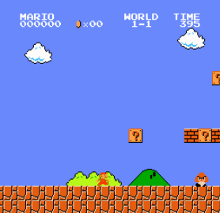

# Super Mario Bros 1

Modified from [MadMario](
https://github.com/YuansongFeng/MadMario)
and [Super-mario-bros-PPO-pytorch](
https://github.com/uvipen/Super-mario-bros-PPO-pytorch)

------

## Implementation

Trained with [PPO](https://arxiv.org/abs/1707.06347) implemented from [tianshou](https://github.com/thu-ml/tianshou)

(Optional) Using SPR(Self-Predictive Representations) to improve: [Data-Efficient Reinforcement Learning with Self-Predictive Representations](https://arxiv.org/abs/2007.05929)

## Install
`pip install -r requirements.txt`

## Train
PPO only

`python main.py --world 1 --stage 1 --log <log_path>`

SPR

`python main.py --world 1 --stage 1 --spr --log <log_path>`

## Test
PPO only

`python test.py --log <log_path> --world 1 --stage 1`

SPR

`python main.py --log <log_path> --world 1 --stage 1 --spr`